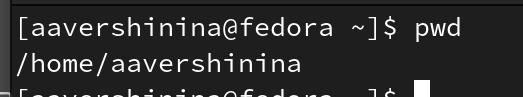
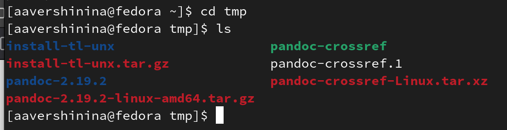
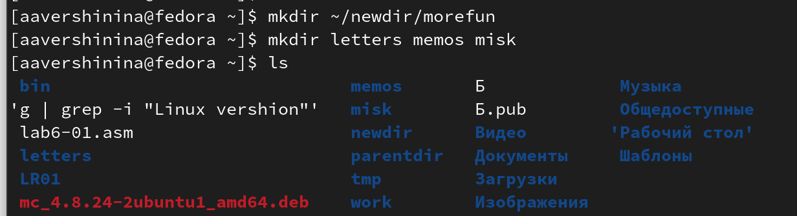
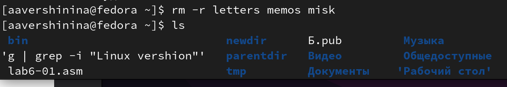
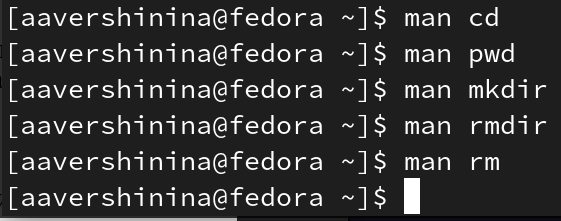
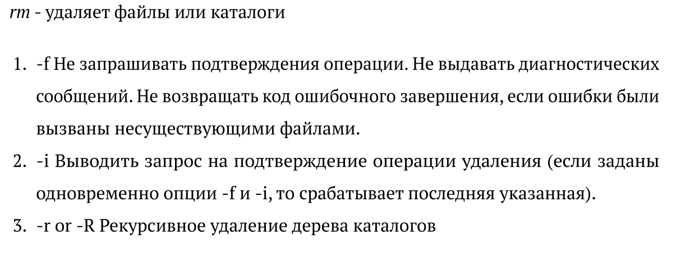

---
## Front matter
lang: ru-RU
title: Лабораторная работа №4
subtitle: Основы интерфейса взаимодействия пользователя с системой Unix на уровне командной строки
author:
  - Вершинина Ангелина 
institute:
  - Российский университет дружбы народов, Москва, Россия
date: 04 марта 2023

## i18n babel
babel-lang: russian
babel-otherlangs: english

## Formatting pdf
toc: false
toc-title: Содержание
slide_level: 2
aspectratio: 169
section-titles: true
theme: metropolis
header-includes:
 - \metroset{progressbar=frametitle,sectionpage=progressbar,numbering=fraction}
 - '\makeatletter'
 - '\beamer@ignorenonframefalse'
 - '\makeatother'
---

# Цель  работы

## Цель

Приобретение практических навыков взаимодействия пользователя с системой по-
средством командной строки

# Задание

## Задание

- используя команды cd, rm, mkdir, pwd и др., произвести операции над файлами и каталогами

# Выполнение лабораторной работы

## Путь к файлу - pwd

- pwd - позволяет узнать полный путь к файлу

{.column width="30%"}

## Перемещение по каталогам - cd

- cd - позволяет перемещаться по каталогам

{.column width="30%"}

## Просмотр содержимого - ls

- ls - позволяет просмотреть, какие подкаталоги и файлы находятся в данном каталоге

{.column width="30%"}

## Создание каталогов - mkdir

- mkdir - позволяет создать каталоги и подкаталоги

{.column width="30%"}

## Удаление файлов и каталогов - rm

- rm- позволяет удалить каталоги, подкаталоги и файлы

{.column width="30%"}

## Команда man

- содержит информацию о командах и их дополнительных опциях

{.column width="30%"}

## Команда man rm

- при помощи команды man rm можно узнать об опциях 

{.column width="30%"}

# Вывод

## Вывод

В ходе выполнения данной лабораторной работы я приобрела практические навыки взаимодействия пользователя с системой по-
средством командной строки.

