---
## Front matter
title: "Лабораторная работа №4"
subtitle: "Основы интерфейса взаимодействия
пользователя с системой Unix на уровне командной строки"
author: "Вершинина Ангелина Алексеевна"
## Generic otions
lang: ru-RU
toc-title: "Содержание"

## Bibliography
bibliography: bib/cite.bib
csl: pandoc/csl/gost-r-7-0-5-2008-numeric.csl

## Pdf output format
toc: true # Table of contents
toc-depth: 2
lof: true # List of figures
lot: true # List of tables
fontsize: 12pt
linestretch: 1.5
papersize: a4
documentclass: scrreprt
## I18n polyglossia
polyglossia-lang:
  name: russian
  options:
	- spelling=modern
	- babelshorthands=true
polyglossia-otherlangs:
  name: english
## I18n babel
babel-lang: russian
babel-otherlangs: english
## Fonts
mainfont: PT Serif
romanfont: PT Serif
sansfont: PT Sans
monofont: PT Mono
mainfontoptions: Ligatures=TeX
romanfontoptions: Ligatures=TeX
sansfontoptions: Ligatures=TeX,Scale=MatchLowercase
monofontoptions: Scale=MatchLowercase,Scale=0.9
## Biblatex
biblatex: true
biblio-style: "gost-numeric"
biblatexoptions:
  - parentracker=true
  - backend=biber
  - hyperref=auto
  - language=auto
  - autolang=other*
  - citestyle=gost-numeric
## Pandoc-crossref LaTeX customization
figureTitle: "Рис."
tableTitle: "Таблица"
listingTitle: "Листинг"
lofTitle: "Список иллюстраций"
lotTitle: "Список таблиц"
lolTitle: "Листинги"
## Misc options
indent: true
header-includes:
  - \usepackage{indentfirst}
  - \usepackage{float} # keep figures where there are in the text
  - \floatplacement{figure}{H} # keep figures where there are in the text
---

# Цель работы

Приобретение практических навыков взаимодействия пользователя с системой по-
средством командной строки.

# Задание

1. Определите полное имя вашего домашнего каталога. Далее относительно этого ката-
лога будут выполняться последующие упражнения.
2. Выполните следующие действия:
- Перейдите в каталог /tmp.
- Выведите на экран содержимое каталога /tmp. Для этого используйте команду ls
с различными опциями. Поясните разницу в выводимой на экран информации.
- Определите, есть ли в каталоге /var/spool подкаталог с именем cron?
- Перейдите в Ваш домашний каталог и выведите на экран его содержимое. Опре-
делите, кто является владельцем файлов и подкаталогов?
3. Выполните следующие действия:
- В домашнем каталоге создайте новый каталог с именем newdir.
- В каталоге ~/newdir создайте новый каталог с именем morefun.
- В домашнем каталоге создайте одной командой три новых каталога с именами
letters, memos, misk. Затем удалите эти каталоги одной командой.
- Попробуйте удалить ранее созданный каталог ~/newdir командой rm. Проверьте,
был ли каталог удалён.
- Удалите каталог ~/newdir/morefun из домашнего каталога. Проверьте, был ли
каталог удалён.
4. С помощью команды man определите, какую опцию команды ls нужно использо-
вать для просмотра содержимое не только указанного каталога, но и подкаталогов,
входящих в него.
5. С помощью команды man определите набор опций команды ls, позволяющий отсорти-
ровать по времени последнего изменения выводимый список содержимого каталога
с развёрнутым описанием файлов.
6. Используйте команду man для просмотра описания следующих команд: cd, pwd, mkdir,
rmdir, rm. Поясните основные опции этих команд.
7. Используя информацию, полученную при помощи команды history, выполните мо-
дификацию и исполнение нескольких команд из буфера команд.

# Теоретическое введение

В операционной системе типа Linux взаимодействие пользователя с системой обычно
осуществляется с помощью командной строки посредством построчного ввода ко-
манд. При этом обычно используется командные интерпретаторы языка shell: /bin/sh;
/bin/csh; /bin/ksh.

**Формат команды**. Командой в операционной системе называется записанный по
специальным правилам текст (возможно с аргументами), представляющий собой ука-
зание на выполнение какой-либо функций (или действий) в операционной системе.
Обычно первым словом идёт имя команды, остальной текст — аргументы или опции,
конкретизирующие действие.

Общий формат команд можно представить следующим образом:
<имя_команды><разделитель><аргументы>

# Выполнение лабораторной работы

Определю полное имя вашего домашнего каталога. Далее относительно этого ката-
лога будут выполняться последующие упражнения.(рис. @[fig:001]).

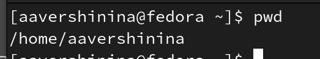{#fig:001 width=70%}

Перейду в каталог /tmp и выведу на экран содержимое каталога (рис. @[fig:002])

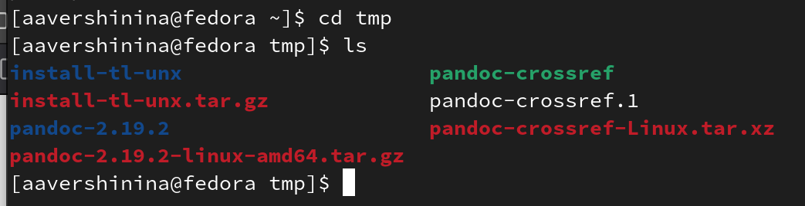{#fig:002 width=70%}

Далее использую команду ls с различными опциями. -а: Вывод списка всех файлов, включая скрытые. -h: Вывод для каждого файла его размера (рис. @[fig:003])

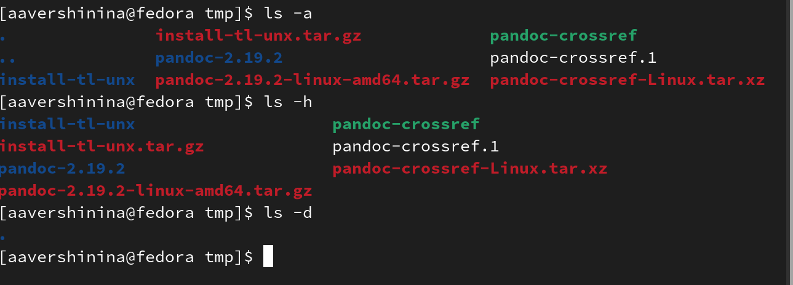{#fig:003 width=70%}

Определю, есть ли в каталоге /var/spool подкаталог с именем cron. Данного каталога нет. (рис. @[fig:004])

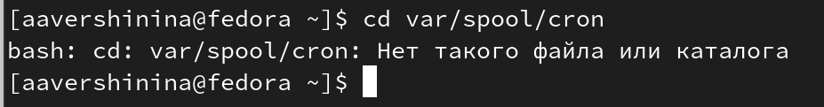{#fig:004 width=70%}

Перейду в свой домашний каталог и выведу на экран его содержимое. Определю, кто является владельцем файлов и подкаталогов(user-aavershinina) (рис. @[fig:005],@[fig:006])

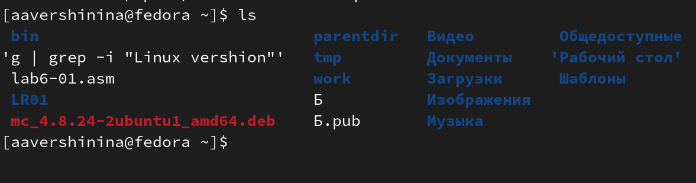{#fig:005 width=70%}

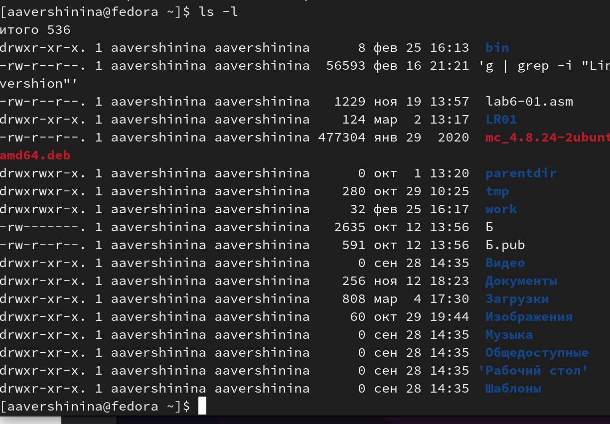{#fig:006 width=70%}

 В домашнем каталоге создам новый каталог с именем newdir и  в каталоге ~/newdir создайте новый каталог с именем morefun (рис. @[fig:007])

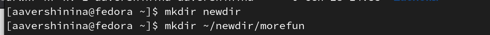{#fig:007 width=70%}

В домашнем каталоге создам одной командой три новых каталога с именами
letters, memos, misk. Затем удалю эти каталоги одной командой. (рис. @[fig:008],@[fig:009])

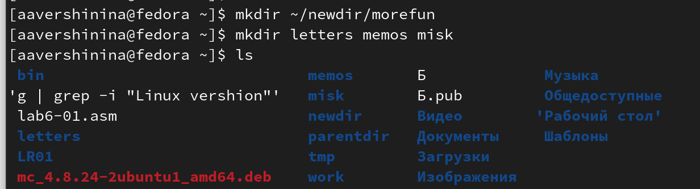{#fig:008 width=70%}

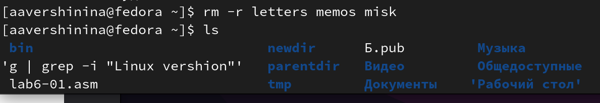{#fig:009 width=70%}

Удалю каталог ~/newdir/morefun из домашнего каталога. Проверю, был ли
каталог удалён.(рис. @[fig:0010])

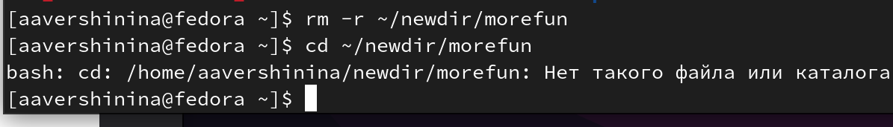{#fig:0010 width=70%}

С помощью команды man определю, какую опцию команды ls нужно использо-
вать для просмотра содержимое не только указанного каталога, но и подкаталогов,
входящих в него. Опция -R (рис. @[fig:0011])

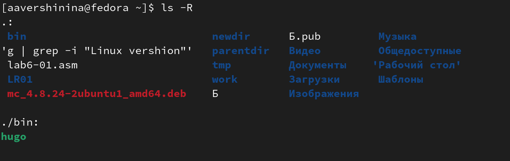{#fig:0011 width=70%}

С помощью команды man определите набор опций команды ls, позволяющий отсорти-
ровать по времени последнего изменения выводимый список содержимого каталога
с развёрнутым описанием файлов. Опция -t (рис. @[fig:0012])

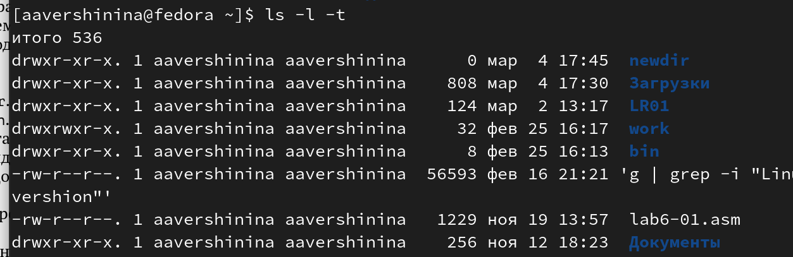{#fig:0012 width=70%}

Использую команду man для просмотра описания следующих команд: cd, pwd, mkdir,
rmdir, rm. (рис. @[fig:0013])

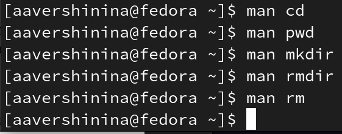{#fig:0013 width=70%}

Поясню основные опции этих команд:

*cd* - изменить рабочий каталог оболочки.

1. P - позволяет следовать по символическим ссылкам перед тем, как будут обработаны все переходы "..";
2. -L - переходит по символическим ссылкам только после того, как были обработаны "..";
3. -e - если папку, в которую нужно перейти не удалось найти - выдает ошибку

*pwd* - возвращает имя рабочего каталога

1. –P, --physical
Отображение физического имени рабочего каталога. Это параметр по умолчанию, если не указан ни один.
2. –L, --logical
Используйте переменную среды PWD в качестве имени рабочего каталога, если это возможно, даже если это символическая ссылка. PWD не должен содержать компонентов “точка” или “точка-точка” и должен указывать на текущий рабочий каталог, если это символическая ссылка. Если эти условия не выполняются, предполагается поведение –P.

*mkdir* - создание каталогов

1. -m, --mode=РЕЖИМ
установки режима файла (как в chmod), а не a=rwx - umask
2. -p, --parents
ошибка отсутствует, если она существует, создайте родительские каталоги по мере необходимости,
при этом режимы их файлов не зависят от какой-либо опции -m.
3. -v, --verbose
выводит сообщение для каждого созданного каталога

*rmdir* - удаление пустых каталогов

1. --ignore-fail-on-non-empty
игнорировать каждый сбой, который вызван исключительно тем, что каталог
непустой
2. -p, --parents
удаляет КАТАЛОГ и его предков; например, 'rmdir -p a/b / c'
аналогично 'rmdir a / b / c a / b a'
3. -v, --подробный
вывод диагностики для каждого обработанного каталога

*rm* - удаляет файлы или каталоги  

1. -f
Не запрашивать подтверждения операции. Не выдавать диагностических сообщений. Не возвращать код ошибочного завершения, если ошибки были вызваны несуществующими файлами.
2. -i
Выводить запрос на подтверждение операции удаления (если заданы одновременно опции -f и -i, то срабатывает последняя указанная).
3. -r or -R
Рекурсивное удаление дерева каталогов

Используя информацию, полученную при помощи команды history рис. @[fig:0014]), выполню модификацию и исполнение команды ls с опцией -i, которая выведет уникальный номер каждого файла.рис. @[fig:0015])

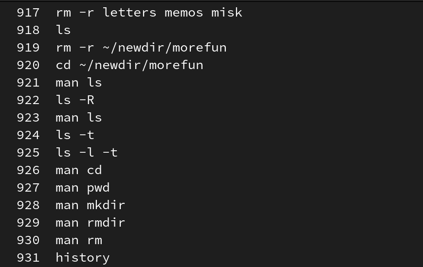{#fig:0014 width=70%}

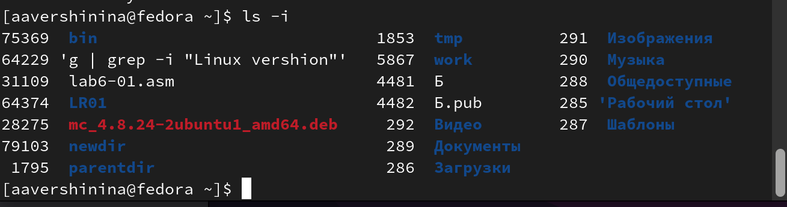{#fig:0015 width=70%}

# Выводы

В ходе выполнения данной лабораторной работы я приобрела практические навыки взаимодействия пользователя с системой по-средством командной строки. 

# Список литературы{.unnumbered}

::: {#refs}
:::
