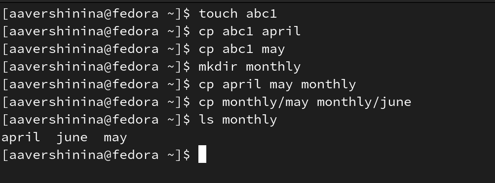
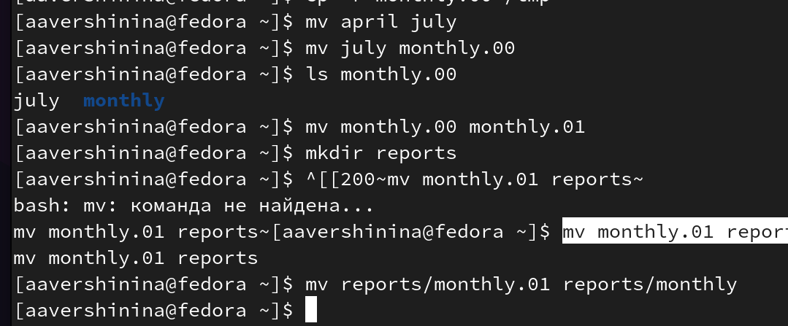
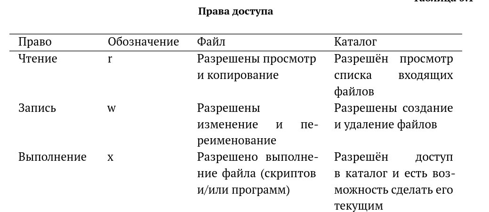
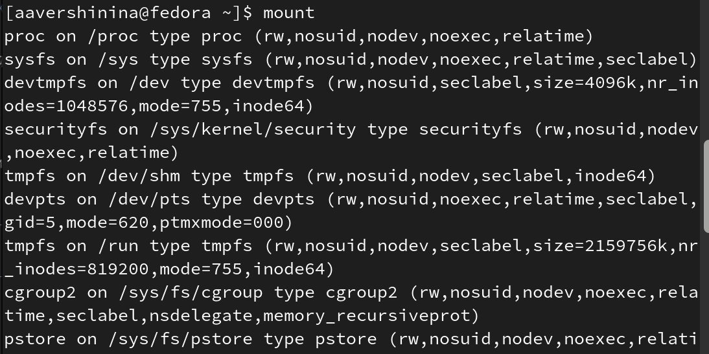

---
## Front matter
lang: ru-RU
title: Лабораторноая работа №5
subtitle: Анализ файловой системы Linux. Команды для работы с файлами и каталогами
author:
  - Вершинина Ангелина
institute:
  - Российский университет дружбы народов, Москва, Россия

## i18n babel
babel-lang: russian
babel-otherlangs: english

## Formatting pdf
toc: false
toc-title: Содержание
slide_level: 2
aspectratio: 169
section-titles: true
theme: metropolis
header-includes:
 - \metroset{progressbar=frametitle,sectionpage=progressbar,numbering=fraction}
 - '\makeatletter'
 - '\beamer@ignorenonframefalse'
 - '\makeatother'
---

# Цель

- Ознакомление с файловой системой Linux, её структурой, именами и содержанием
каталогов. Приобретение практических навыков по применению команд для работы
с файлами и каталогами, по управлению процессами (и работами), по проверке исполь-
зования диска и обслуживанию файловой системы

# Задание

- Изучить команды для работы с файлами и каталогами и выполнить упражнения

# Выполнение работы

## Команда touch, cat 

- touch - cозданиt текстового файла

- cat - просмотра файлов

{.column width="30%"}

## Команда сз

- cp - копирование файлов и каталогов

{.column width="30%"}

## Команда mv 

- mv - перемещение файлов и каталогов

{.column width="30%"}

## Права доступа

{.column width="30%"}

## Команда mount

- mount - просмотр используемых в операционной системе файловых систем.

{.column width="30%"}

## Команда fsck

- С помощью команды fsck можно проверить (а в ряде случаев восстановить) целост-
ность файловой системы

# Вывод 

- В ходе выполнения лабораторной работы я ознакомление с файловой системой Linux, её структурой, именами и содержанием каталогов. Приобрела практические навыки по применению команд для работы
с файлами и каталогами, по управлению процессами (и работами), по проверке исполь-
зования диска и обслуживанию файловой системы.

