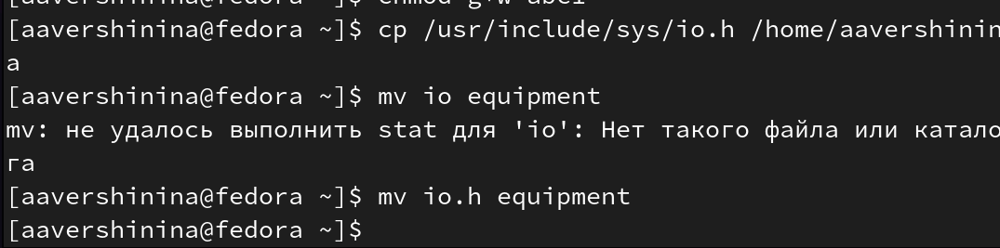

---
## Front matter
title: "Лабораторная работа №5"
subtitle: "Анализ файловой системы Linux.
Команды для работы с файлами и каталогами"
author: "Вершинина Ангелина Алексеевна"

## Generic otions
lang: ru-RU
toc-title: "Содержание"

## Bibliography
bibliography: bib/cite.bib
csl: pandoc/csl/gost-r-7-0-5-2008-numeric.csl

## Pdf output format
toc: true # Table of contents
toc-depth: 2
lof: true # List of figures
lot: true # List of tables
fontsize: 12pt
linestretch: 1.5
papersize: a4
documentclass: scrreprt
## I18n polyglossia
polyglossia-lang:
  name: russian
  options:
	- spelling=modern
	- babelshorthands=true
polyglossia-otherlangs:
  name: english
## I18n babel
babel-lang: russian
babel-otherlangs: english
## Fonts
mainfont: PT Serif
romanfont: PT Serif
sansfont: PT Sans
monofont: PT Mono
mainfontoptions: Ligatures=TeX
romanfontoptions: Ligatures=TeX
sansfontoptions: Ligatures=TeX,Scale=MatchLowercase
monofontoptions: Scale=MatchLowercase,Scale=0.9
## Biblatex
biblatex: true
biblio-style: "gost-numeric"
biblatexoptions:
  - parentracker=true
  - backend=biber
  - hyperref=auto
  - language=auto
  - autolang=other*
  - citestyle=gost-numeric
## Pandoc-crossref LaTeX customization
figureTitle: "Рис."
tableTitle: "Таблица"
listingTitle: "Листинг"
lofTitle: "Список иллюстраций"
lotTitle: "Список таблиц"
lolTitle: "Листинги"
## Misc options
indent: true
header-includes:
  - \usepackage{indentfirst}
  - \usepackage{float} # keep figures where there are in the text
  - \floatplacement{figure}{H} # keep figures where there are in the text
---

# Цель работы

Ознакомление с файловой системой Linux, её структурой, именами и содержанием
каталогов. Приобретение практических навыков по применению команд для работы
с файлами и каталогами, по управлению процессами (и работами), по проверке исполь-
зования диска и обслуживанию файловой системы.

# Задание

Используя команды для работы с файлами и каталогами выполнить упражнения

# Теоретическое введение

Для создания текстового файла можно использовать команду touch.
Формат команды:

touch имя-файла

Для просмотра файлов небольшого размера можно использовать команду cat.
Формат команды:

cat имя-файла

Для просмотра файлов постранично удобнее использовать команду less.
Формат команды:

less имя-файла

# Выполнение лабораторной работы

Выполню примеры из первой части описания лабораторной работы.

Пример 1. Копирование файлов и каталогов

**Задание**

Скопировать файл ~/abc1 в файл april и в файл may. Скопировать файлы april и may в каталог monthly. Скопировать файл monthly/may в файл с именем june.  (рис. @fig:001)

{#fig:001 width=70%}

Пример 2. Копирование файлов и каталогов

**Задание**

Скопировать каталог monthly в каталог monthly.00. Скопировать каталог monthly.00
в каталог /tmp (рис. @fig:002)

{#fig:002 width=70%}

Пример 3. Перемещение и переименование файлов и каталогов

**Задание**

Изменить название файла april на july в домашнем каталоге. Переместить файл july в каталог monthly.00. Переименовать каталог reports/monthly.01 в reports/monthly. (рис. @fig:003)

{#fig:003 width=70%}

Пример 4. Права доступа

**Задание**

Требуется создать файл ~/may с правом выполнения для владельца. ребуется лишить владельца файла ~/may права на выполнени. Требуется создать каталог monthly с запретом на чтение для членов группы и всех остальных пользователей. Требуется создать файл ~/abc1 с правом записи для членов группы (рис. @fig:004)

{#fig:004 width=70%}

Скопирую файл /usr/include/sys/io.h в домашний каталог и назову его equipment. (рис. @fig:005)

{#fig:005 width=70%}

В домашнем каталоге создам директорию ~/ski.plases. Перемещу файл equipment в каталог ~/ski.plases. ереименую файл ~/ski.plases/equipment в ~/ski.plases/equiplist.(рис. @fig:006)

{#fig:006 width=70%}

Создам в домашнем каталоге файл abc1 и скопирую его в каталог ~/ski.plases, назову его equiplist2. (рис. @fig:007)

{#fig:007 width=70%}

Создам каталог с именем equipment в каталоге ~/ski.plases. Перемещу файлы ~/ski.plases/equiplist и equiplist2 в каталог ~/ski.plases/equipment(рис. @fig:008)

{#fig:008 width=70%}

Создам и перемещу каталог ~/newdir в каталог ~/ski.plases и назову его plans. (рис. @fig:009)

{#fig:009 width=70%}

Создам нужные файлы и определю опции команды chmod, необходимые для того, чтобы присвоить перечисленным ниже файлам выделенные права доступа, считая, что в начале таких прав нет. (рис. @fig:0010)

{#fig:0010 width=70%}

*Выполню следующие упражнения:* (рис. @fig:0011)

1. Просмотрите содержимое файла /etc/password.
2. Скопируйте файл ~/feathers в файл ~/file.old.
3. Переместите файл ~/file.old в каталог ~/play.
4. Скопируйте каталог ~/play в каталог ~/fun.
5. Переместите каталог ~/fun в каталог ~/play и назовите его games.
6. Лишите владельца файла ~/feathers права на чтение.
7. Что произойдёт, если вы попытаетесь просмотреть файл ~/feathers командой
cat? *На это не прав доступа, ошибка в терминале*
8. Что произойдёт, если вы попытаетесь скопировать файл ~/feathers? *На это не прав доступа, ошибка в терминале*
9. Дайте владельцу файла ~/feathers право на чтение.
10. Лишите владельца каталога ~/play права на выполнение.
11. Перейдите в каталог ~/play. Что произошло? *На это не прав доступа, ошибка в терминале*
12. Дайте владельцу каталога ~/play право на выполнение.

{#fig:0011 width=70%}

*Выполнение команды man:*

Команда man mount: (рис. @fig:0012 и @fig:0013)

mount - просмотр используемых в операционной системе файловых систем

{#fig:0012 width=70%}

{#fig:0013 width=70%}

Команда man fsck: (рис. @fig:0014)

fsck - проверить (а в ряде случаев восстановить) целост-
ность файловой системы 

{#fig:0014 width=70%}

Команда man kill: (рис. @fig:0015)

kill - отправить сигнал процессору

{#fig:0015 width=70%}

# Выводы

В ходе выполнения лабораторной работы я ознакомилась с файловой системой Linux, её структурой, именами и содержанием
каталогов. Приобрела практических навыков по применению команд для работы
с файлами и каталогами, по управлению процессами (и работами), по проверке использования диска и обслуживанию файловой системы.

# Список литературы{.unnumbered}

::: {#refs}
:::
