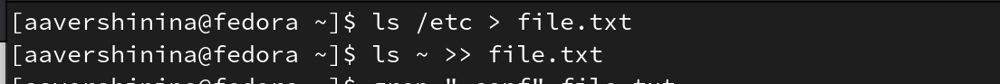
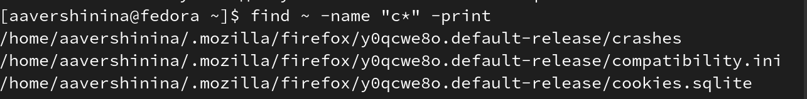
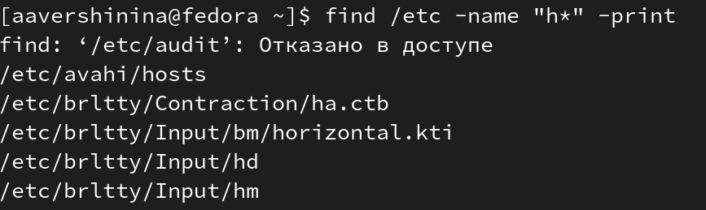
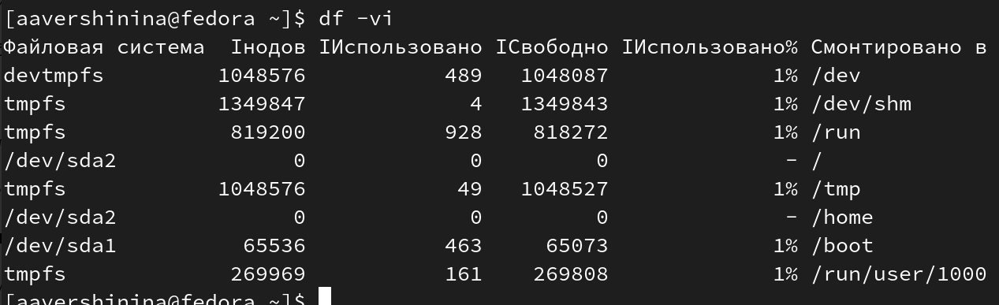

---
## Front matter
lang: ru-RU
title: Лабораторная работа №6
subtitle: Поиск файлов. Перенаправление ввода-вывода. Просмотр запущенных процессов
author:
  - Вершинина Ангелина
institute:
  - Российский университет дружбы народов, Москва, Россия

## i18n babel
babel-lang: russian
babel-otherlangs: english

## Formatting pdf
toc: false
toc-title: Содержание
slide_level: 2
aspectratio: 169
section-titles: true
theme: metropolis
header-includes:
 - \metroset{progressbar=frametitle,sectionpage=progressbar,numbering=fraction}
 - '\makeatletter'
 - '\beamer@ignorenonframefalse'
 - '\makeatother'
---

# Цель работы

Ознакомление с инструментами поиска файлов и фильтрации текстовых данных.
Приобретение практических навыков: по управлению процессами (и заданиями), по
проверке использования диска и обслуживанию файловых систем.

# Выполнение лабораторной работы

## Перенаправление ввода-вывода

- В системе по умолчанию открыто три специальных потока:
1. stdin — стандартный поток ввода (по умолчанию: клавиатура), файловый дескриптор
0;
2. stdout — стандартный поток вывода (по умолчанию: консоль), файловый дескриптор
1;
3. stderr — стандартный поток вывод сообщений об ошибках (по умолчанию: консоль),
файловый дескриптор 2

- Потоки вывода
и ввода можно перенаправлять на другие файлы или устройства. Проще всего это делается
с помощью символов >, >>, <, <<. 

{.column width="40%"}

## Конвейер

- Конвейер (pipe) служит для объединения простых команд или утилит в цепочки, в ко-
торых результат работы предыдущей команды передаётся последующей. 

Синтаксис
следующий: команда 1 | команда 2

## Поиск файла

- Команда find используется для поиска и отображения на экран имён файлов, соответ-
ствующих заданной строке символов

{.column width="40%"}

## Фильтрация текста

- Найти в текстовом файле указанную строку символов позволяет команда grep

{.column width="40%"}

## Проверка использования диска

- Команда df показывает размер каждого смонтированного раздела диска.
- Команда du показывает число килобайт, используемое каждым файлом или каталогом.

{.column width="40%"}

## Управление задачами

- Любую выполняющуюся в консоли команду или внешнюю программу можно запустить
в фоновом режиме. Для этого следует в конце имени команды указать знак амперсанда
&.

{.column width="40%"}

## Получение информации о процессах

- Команда ps используется для получения информации о процессах.

{.column width="40%"}

# Вывод

- Я ознакомлась с инструментами поиска файлов и фильтрации текстовых данных.
- Приобрела практические навыки: по управлению процессами (и заданиями), по
проверке использования диска и обслуживанию файловых систем.

