---
## Front matter
title: "Лабораторная работа №6"
subtitle: "Поиск файлов. Перенаправление ввода-вывода. Просмотр запущенных процессов"
author: "Вершинина Ангелина Алексеевна"

## Generic otions
lang: ru-RU
toc-title: "Содержание"

## Bibliography
bibliography: bib/cite.bib
csl: pandoc/csl/gost-r-7-0-5-2008-numeric.csl

## Pdf output format
toc: true # Table of contents
toc-depth: 2
lof: true # List of figures
lot: true # List of tables
fontsize: 12pt
linestretch: 1.5
papersize: a4
documentclass: scrreprt
## I18n polyglossia
polyglossia-lang:
  name: russian
  options:
	- spelling=modern
	- babelshorthands=true
polyglossia-otherlangs:
  name: english
## I18n babel
babel-lang: russian
babel-otherlangs: english
## Fonts
mainfont: PT Serif
romanfont: PT Serif
sansfont: PT Sans
monofont: PT Mono
mainfontoptions: Ligatures=TeX
romanfontoptions: Ligatures=TeX
sansfontoptions: Ligatures=TeX,Scale=MatchLowercase
monofontoptions: Scale=MatchLowercase,Scale=0.9
## Biblatex
biblatex: true
biblio-style: "gost-numeric"
biblatexoptions:
  - parentracker=true
  - backend=biber
  - hyperref=auto
  - language=auto
  - autolang=other*
  - citestyle=gost-numeric
## Pandoc-crossref LaTeX customization
figureTitle: "Рис."
tableTitle: "Таблица"
listingTitle: "Листинг"
lofTitle: "Список иллюстраций"
lotTitle: "Список таблиц"
lolTitle: "Листинги"
## Misc options
indent: true
header-includes:
  - \usepackage{indentfirst}
  - \usepackage{float} # keep figures where there are in the text
  - \floatplacement{figure}{H} # keep figures where there are in the text
---

# Цель работы

Ознакомление с инструментами поиска файлов и фильтрации текстовых данных.
Приобретение практических навыков: по управлению процессами (и заданиями), по
проверке использования диска и обслуживанию файловых систем.

# Задание

Изучить новые команды и при помощи них выполнить упражнения.

# Теоретическое введение

В системе по умолчанию открыто три специальных потока:
– stdin — стандартный поток ввода (по умолчанию: клавиатура), файловый дескриптор
0;
– stdout — стандартный поток вывода (по умолчанию: консоль), файловый дескриптор
1;
– stderr — стандартный поток вывод сообщений об ошибках (по умолчанию: консоль),
файловый дескриптор 2.
Большинство используемых в консоли команд и программ записывают результаты
своей работы в стандартный поток вывода stdout. Например, команда ls выводит в стан-
дартный поток вывода (консоль) список файлов в текущей директории. Потоки вывода
и ввода можно перенаправлять на другие файлы или устройства. Проще всего это делается
с помощью символов >, >>, <, <<.

# Выполнение лабораторной работы

Выполню вход в систему, используя соответствующее имя пользователя.

Запишу в файл file.txt названия файлов, содержащихся в каталоге /etc. Допишу в этот же файл названия файлов, содержащихся в вашем домашнем каталоге.(рис. @fig:001).

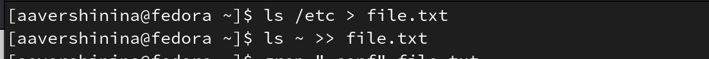{#fig:001 width=70%}

Выведу имена всех файлов из file.txt, имеющих расширение .conf, после чего
запишу их в новый текстовой файл conf.txt (рис. @fig:002)

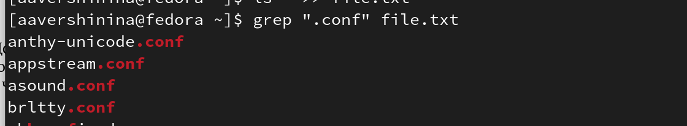{#fig:002 width=70%}

Определю, какие файлы в вашем домашнем каталоге имеют имена, начинавшиеся с символа c (рис. @fig:003)

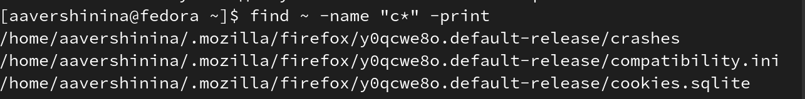{#fig:003 width=70%}

Выведу на экран имена файлов из каталога /etc, начинающиеся с символа h (рис. @fig:004)

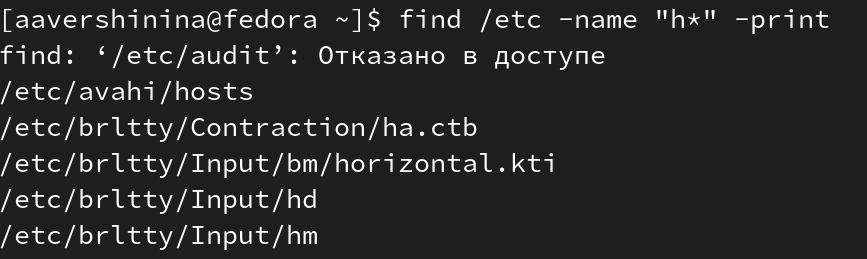{#fig:004 width=70%}

Запущу в фоновом режиме процесс, который будет записывать в файл ~/logfile
файлы, имена которых начинаются с log. (рис. @fig:005, @fig:006)

{#fig:005 width=70%}

{#fig:006 width=70%}

Удалю файл ~/logfile (рис. @fig:007)

{#fig:007 width=70%}

Запущу из консоли в фоновом режиме редактор gedit.(рис. @fig:008)

{#fig:008 width=70%}

Определю идентификатор процесса gedit, используя команду ps, конвейер и фильтр
grep. (рис. @fig:009)

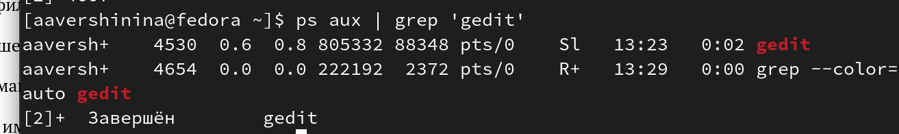{#fig:009 width=70%}

Прочту справку (man) команды kill, после чего использую её для завершения
процесса gedit (рис. @fig:0010, @fig:0011)

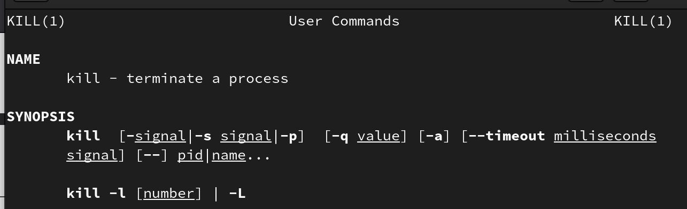{#fig:0010 width=70%}

{#fig:0010 width=70%}

Выполню команды df и du, предварительно получив более подробную информацию
об этих командах, с помощью команды man.(рис. @fig:0012, @fig:0013, @fig:0014, @fig:0015)

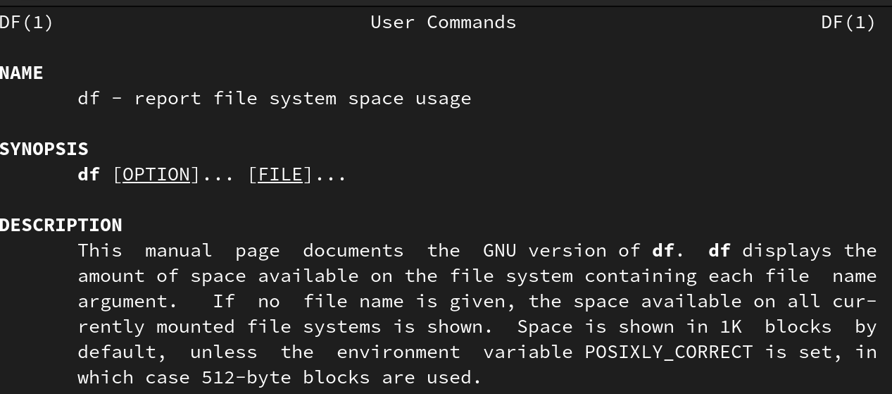{#fig:0012 width=70%}

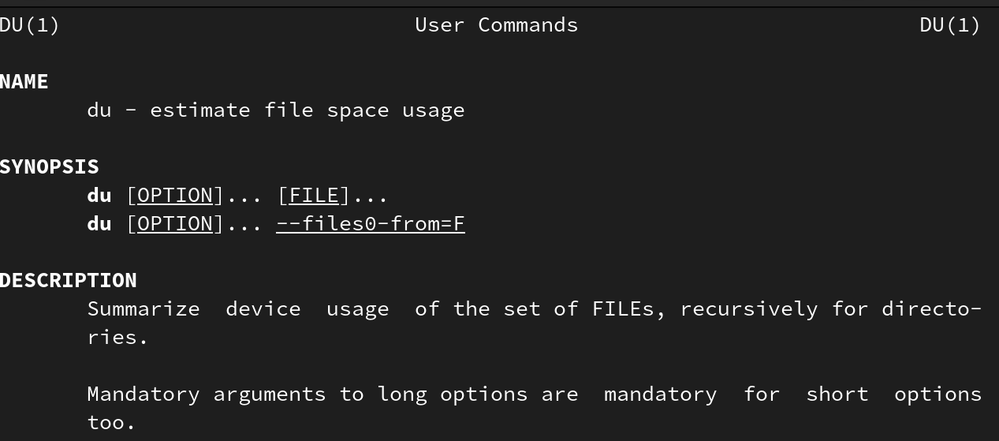{#fig:0013 width=70%}

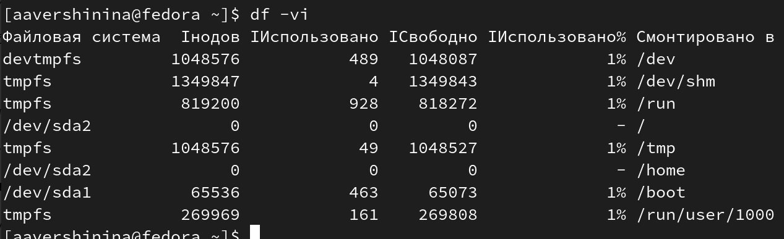{#fig:0014 width=70%}

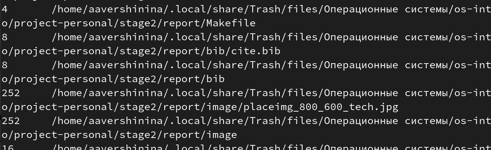{#fig:0015 width=70%}

Воспользовавшись справкой команды find, выведe имена всех директорий, имеющихся в вашем домашнем каталоге. finf ~ -print (рис. @fig:0016)

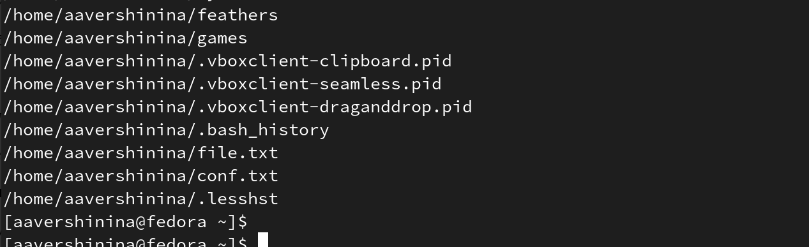{#fig:0016 width=70%}

# Выводы

В ходе выполнения лабораторной работы я ознакомилась с инструментами поиска файлов и фильтрации текстовых данных.
Приобрела практические навыки: по управлению процессами (и заданиями), по
проверке использования диска и обслуживанию файловых систем

# Список литературы{.unnumbered}

::: {#refs}
:::
