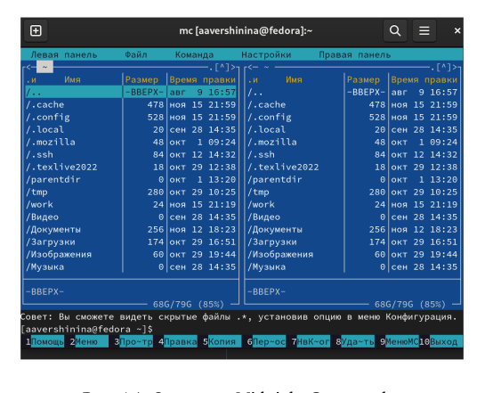

---
## Front matter
lang: ru-RU
title: Лабораторная работа №7
subtitle: Командная оболочка mc
author:
  - Вершинина Ангелина
institute:
  - Российский университет дружбы народов, Москва, Россия

## i18n babel
babel-lang: russian
babel-otherlangs: english

## Formatting pdf
toc: false
toc-title: Содержание
slide_level: 2
aspectratio: 169
section-titles: true
theme: metropolis
header-includes:
 - \metroset{progressbar=frametitle,sectionpage=progressbar,numbering=fraction}
 - '\makeatletter'
 - '\beamer@ignorenonframefalse'
 - '\makeatother'
---

# Цель работы

## Цель

Освоение основных возможностей командной оболочки Midnight Commander. Приоб-
ретение навыков практической работы по просмотру каталогов и файлов; манипуляций
с ними

{.column width="30%"}

:::
::::::::::::::

# Выполнение

## 

{.column width="70%"}

## 

{.column width="70%"}

## 

{.column width="70%"}

## 

{.column width="70%"}

## 

{.column width="70%"}

# Вывод

Освоение основных возможностей командной оболочки Midnight Commander. Приоб-
ретение навыков практической работы по просмотру каталогов и файлов; манипуляций
с ними

