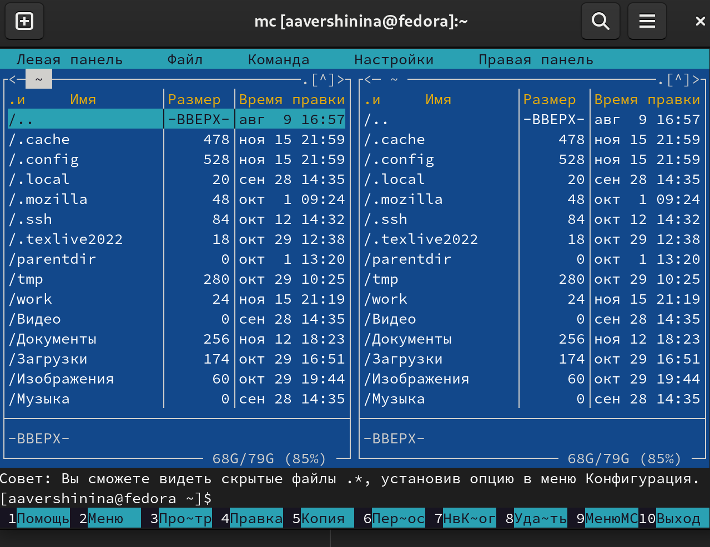
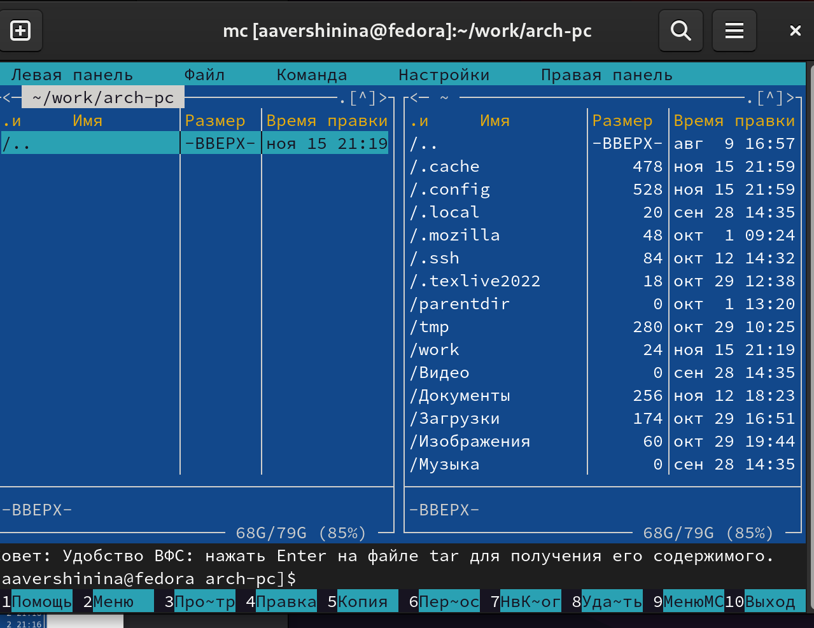
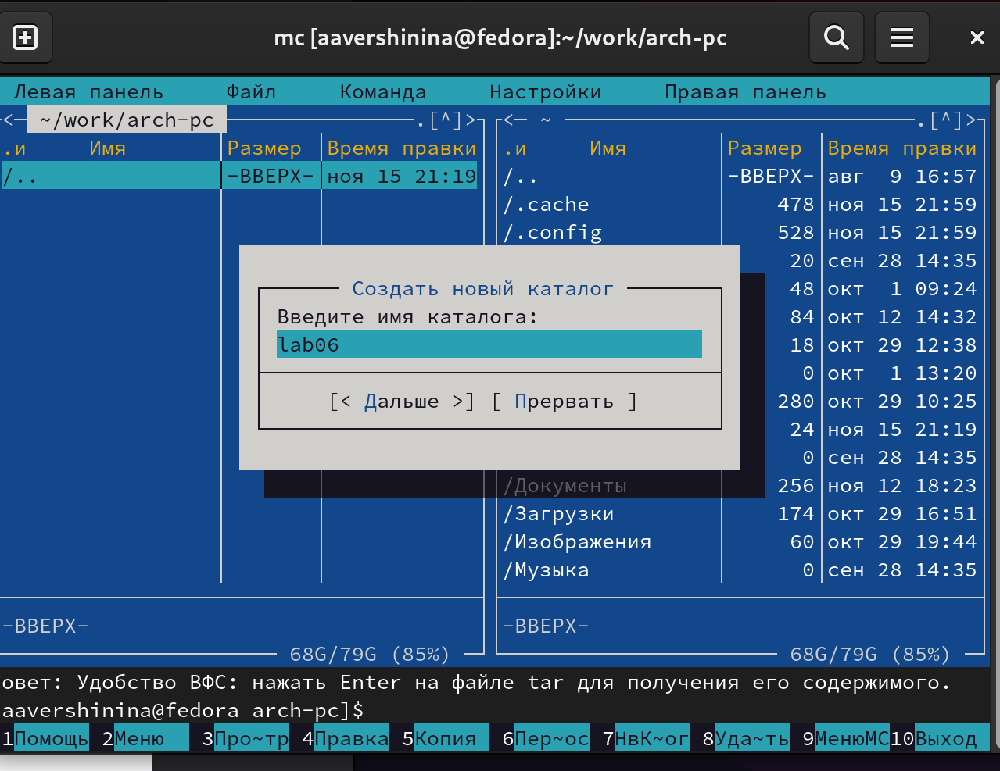
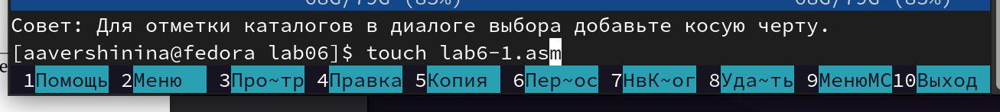
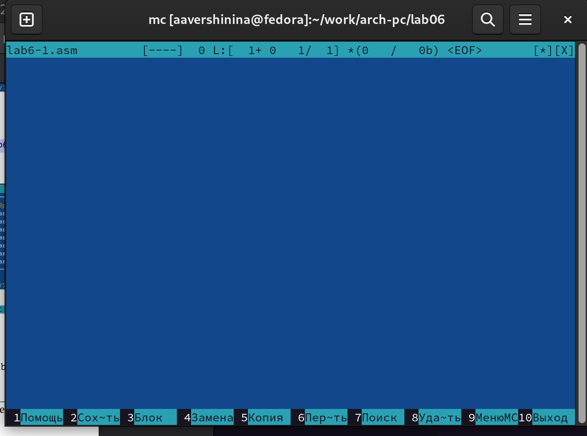
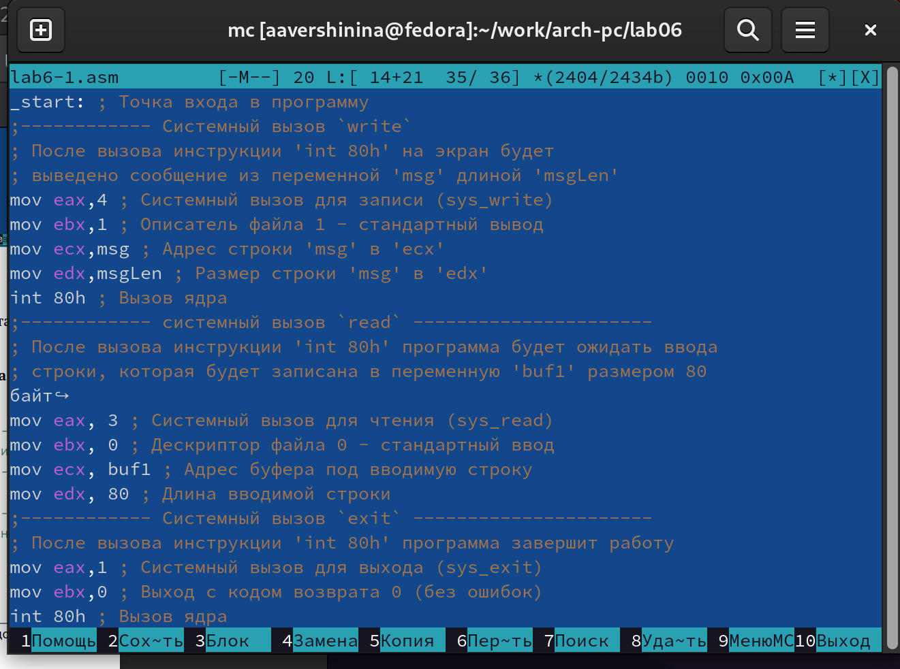
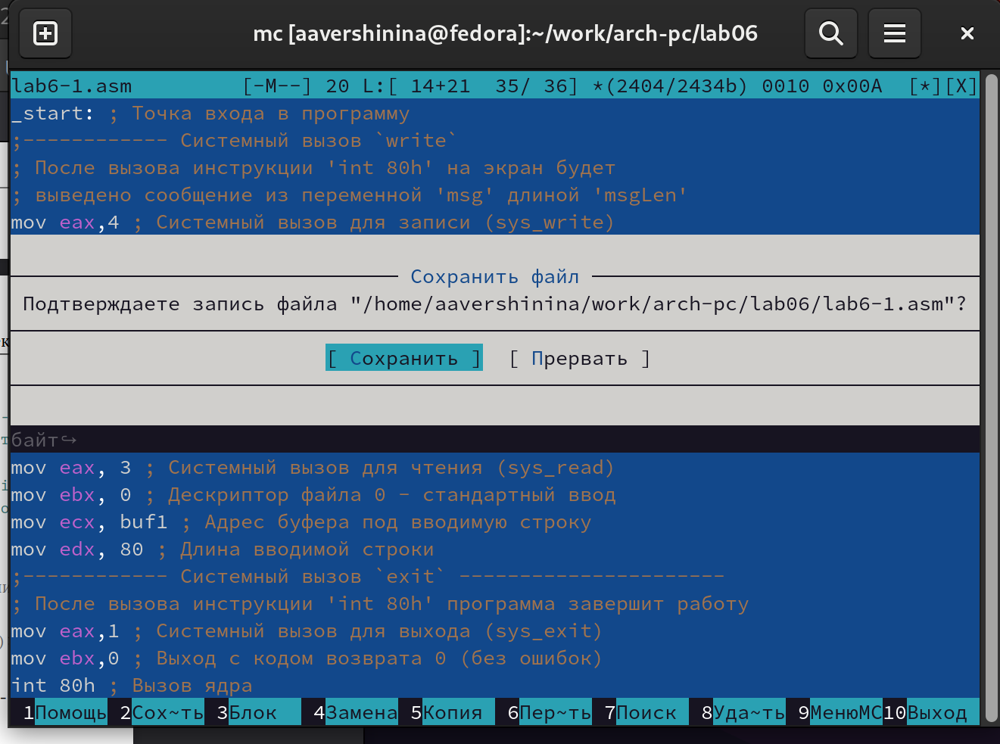
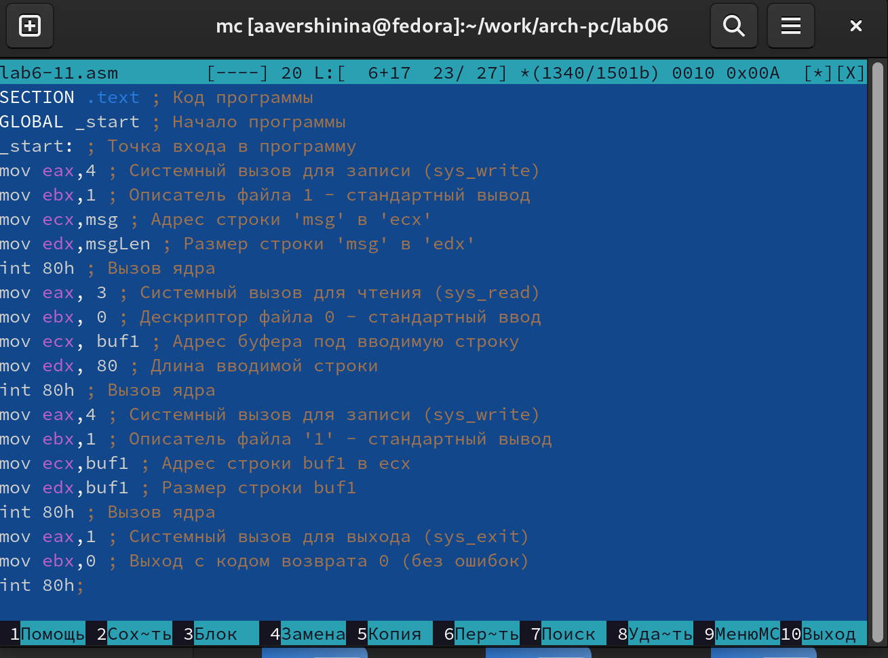

---
## Front matter
title: "Лабораторная работа №7"
subtitle: "Midnight Commander (mc)." 
author: "Вершинина Ангелина Алексеевна"

## Generic otions
lang: ru-RU
toc-title: "Содержание"

## Bibliography
bibliography: bib/cite.bib
csl: pandoc/csl/gost-r-7-0-5-2008-numeric.csl

## Pdf output format
toc: true # Table of contents
toc-depth: 2
lof: true # List of figures
lot: true # List of tables
fontsize: 12pt
linestretch: 1.5
papersize: a4
documentclass: scrreprt
## I18n polyglossia
polyglossia-lang:
  name: russian
  options:
	- spelling=modern
	- babelshorthands=true
polyglossia-otherlangs:
  name: english
## I18n babel
babel-lang: russian
babel-otherlangs: english
## Fonts
mainfont: PT Serif
romanfont: PT Serif
sansfont: PT Sans
monofont: PT Mono
mainfontoptions: Ligatures=TeX
romanfontoptions: Ligatures=TeX
sansfontoptions: Ligatures=TeX,Scale=MatchLowercase
monofontoptions: Scale=MatchLowercase,Scale=0.9
## Biblatex
biblatex: true
biblio-style: "gost-numeric"
biblatexoptions:
  - parentracker=true
  - backend=biber
  - hyperref=auto
  - language=auto
  - autolang=other*
  - citestyle=gost-numeric
## Pandoc-crossref LaTeX customization
figureTitle: "Рис."
tableTitle: "Таблица"
listingTitle: "Листинг"
lofTitle: "Список иллюстраций"
lotTitle: "Список таблиц"
lolTitle: "Листинги"
## Misc options
indent: true
header-includes:
  - \usepackage{indentfirst}
  - \usepackage{float} # keep figures where there are in the text
  - \floatplacement{figure}{H} # keep figures where there are in the text
---

# Цель работы

Освоение основных возможностей командной оболочки Midnight Commander. Приоб-
ретение навыков практической работы по просмотру каталогов и файлов; манипуляций
с ними

# Задание

Работа с файлом в mc

# Теоретическое введение

Midnight Commander (или просто mc) — это программа, которая позволяет
просматривать структуру каталогов и выполнять основные операции по управ-
лению файловой системой, т.е. mc является файловым менеджером. Midnight
Commander позволяет сделать работу с файлами более удобной и наглядной.

# Выполнение лабораторной работы

Открою Midnight Commander (рис. [-@fig:001])

{ #fig:001 width=70% }

Пользуясь клавишами ↑ , ↓ и Enter перейду в каталог ~/work/arch-pc (рис. [-@fig:002])

{ #fig:002 width=70% }

С помощью функциональной клавиши F7 создам папку lab06 (рис. [-@fig:003])
и перейду в созданный каталог.

{ #fig:003 width=70% }

Пользуясь строкой ввода и командой touch создам файл lab6-1.asm (рис. [-@fig:004])

{ #fig:004 width=70% }

С помощью функциональной клавиши F4 открою файл lab6-1.asm для редактирования во встроенном редакторе (рис. [-@fig:005])

{ #fig:005 width=70% }

Введу текст программы из листинга 6.1 (рис. [-@fig:006]), со-
храню изменения (рис. [-@fig:007]) и закрою файл.

{ #fig:006 width=70% }

{ #fig:007 width=70% }

Создам копию файла lab6-1.asm с именем lab6-11.asm с помощью функциональной клавиши F5. С помощью функциональной клавиши F4 открываю созданный файл для редактирования. Изменю программу так, чтобы кроме вывода приглашения и запроса ввода, производился вывод вводимой пользователем строки (рис. [-@fig:0015])

{ #fig:0015 width=70% }

# Выводы

При выполнении данной лабораторной работы я освоила основные возможности командной оболочки Midnight Commander. Приобрела навыки практической работы по просмотру каталогов и файлов; манипуляций с ними

# Список литературы{.unnumbered}

::: {#refs}
:::
