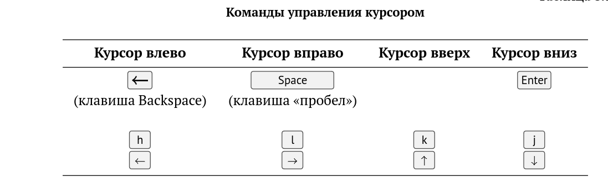
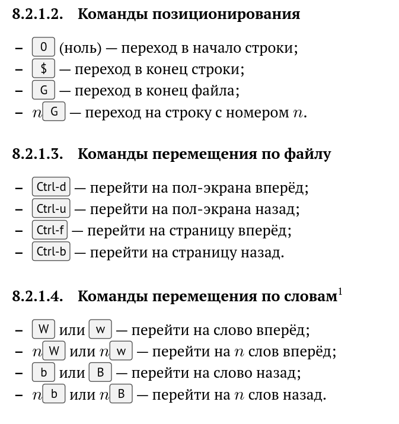
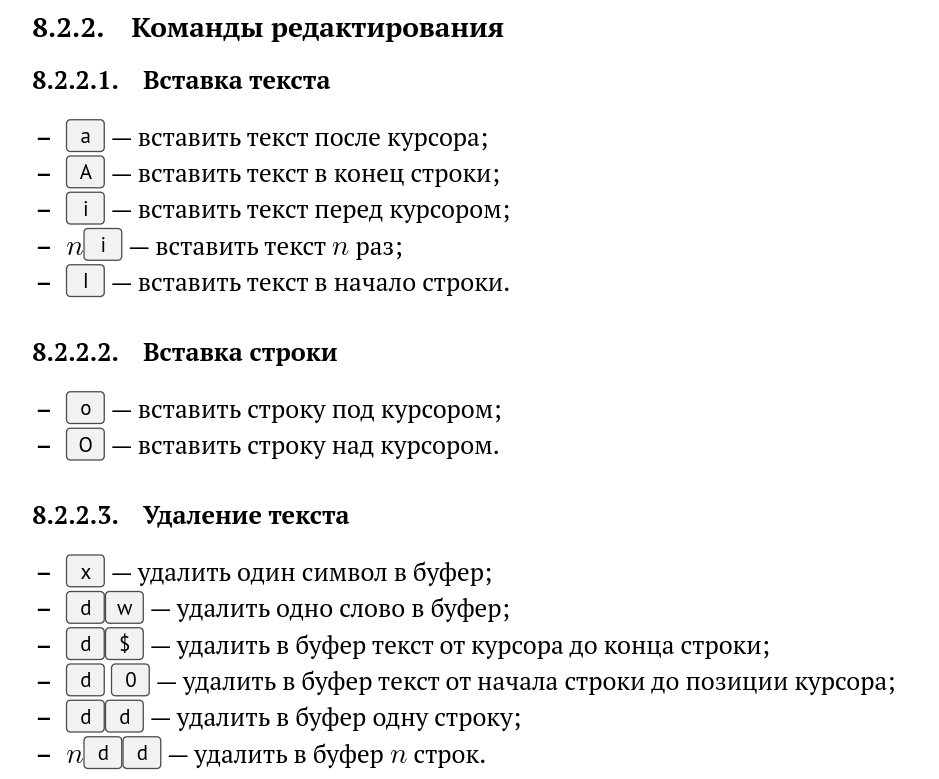
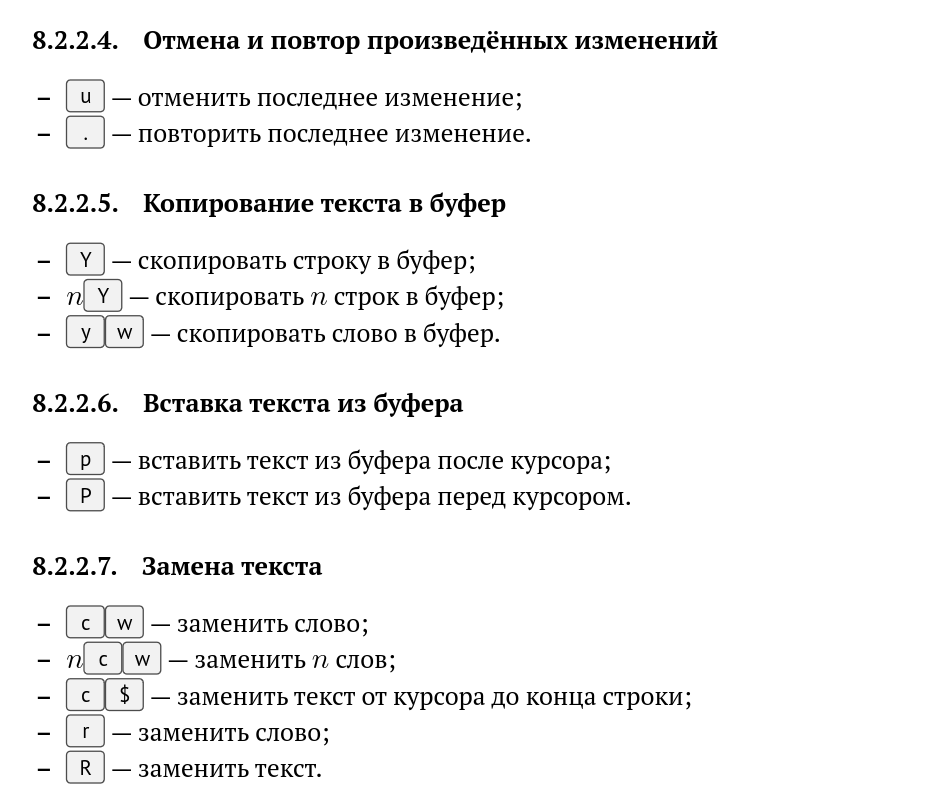
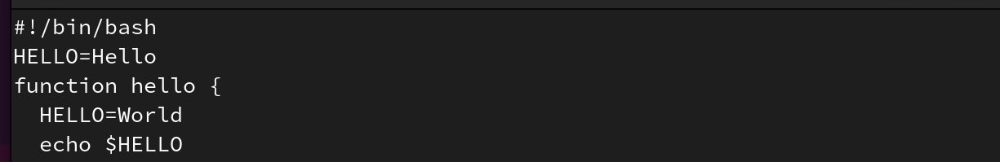
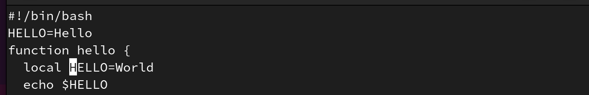
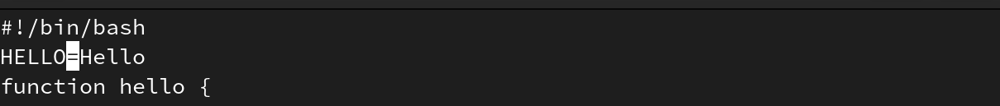

---
## Front matter
lang: ru-RU
title: Лабораторная работа №10
subtitle: Командные файлы
author:
  - Вершинина Ангелина
institute:
  - Российский университет дружбы народов, Москва, Россия
  
date: 15 апреля 2023

## i18n babel
babel-lang: russian
babel-otherlangs: english

## Formatting pdf
toc: false
toc-title: Содержание
slide_level: 2
aspectratio: 169
section-titles: true
theme: metropolis
header-includes:
 - \metroset{progressbar=frametitle,sectionpage=progressbar,numbering=fraction}
 - '\makeatletter'
 - '\beamer@ignorenonframefalse'
 - '\makeatother'
---

# Цель работы

## Цель

Познакомиться с операционной системой Linux. Получить практические навыки рабо-
ты с редактором vi, установленным по умолчанию практически во всех дистрибутивах.

# Выполнение работы

## 

{.column width="80%"}

## 

{.column width="80%"}

## 

{.column width="80%"}

## 

{.column width="80%"}

## 

{.column width="80%"}

## 

{.column width="80%"}

## 

{.column width="80%"}

## Вывод 

- Я познакомилась с операционной системой Linux. 
- Получила практические навыки работы с редактором vi, установленным по умолчанию практически во всех дистрибутивах.

