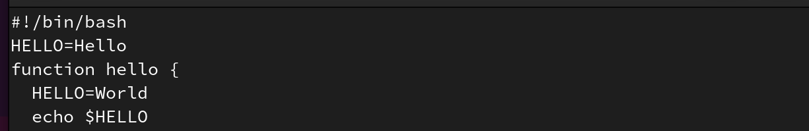

---
## Front matter
title: "Лабораторная работа №10"
subtitle: "Командные файлы"
author: "Вершинина Ангелина"

## Generic otions
lang: ru-RU
toc-title: "Содержание"

## Bibliography
bibliography: bib/cite.bib
csl: pandoc/csl/gost-r-7-0-5-2008-numeric.csl

## Pdf output format
toc: true # Table of contents
toc-depth: 2
lof: true # List of figures
lot: true # List of tables
fontsize: 12pt
linestretch: 1.5
papersize: a4
documentclass: scrreprt
## I18n polyglossia
polyglossia-lang:
  name: russian
  options:
	- spelling=modern
	- babelshorthands=true
polyglossia-otherlangs:
  name: english
## I18n babel
babel-lang: russian
babel-otherlangs: english
## Fonts
mainfont: PT Serif
romanfont: PT Serif
sansfont: PT Sans
monofont: PT Mono
mainfontoptions: Ligatures=TeX
romanfontoptions: Ligatures=TeX
sansfontoptions: Ligatures=TeX,Scale=MatchLowercase
monofontoptions: Scale=MatchLowercase,Scale=0.9
## Biblatex
biblatex: true
biblio-style: "gost-numeric"
biblatexoptions:
  - parentracker=true
  - backend=biber
  - hyperref=auto
  - language=auto
  - autolang=other*
  - citestyle=gost-numeric
## Pandoc-crossref LaTeX customization
figureTitle: "Рис."
tableTitle: "Таблица"
listingTitle: "Листинг"
lofTitle: "Список иллюстраций"
lotTitle: "Список таблиц"
lolTitle: "Листинги"
## Misc options
indent: true
header-includes:
  - \usepackage{indentfirst}
  - \usepackage{float} # keep figures where there are in the text
  - \floatplacement{figure}{H} # keep figures where there are in the text
---

# Цель работы

Познакомиться с операционной системой Linux. Получить практические навыки работы с редактором vi, установленным по умолчанию практически во всех дистрибутивах.

# Задание

Отработать практические навыки работы с редактором vi

# Теоретическое введение

В большинстве дистрибутивов Linux в качестве текстового редактора по умолчанию
устанавливается интерактивный экранный редактор vi (Visual display editor).
Редактор vi имеет три режима работы:
– командный режим — предназначен для ввода команд редактирования и навигации по
редактируемому файлу;
– режим вставки — предназначен для ввода содержания редактируемого файла;
– режим последней (или командной) строки — используется для записи изменений в файл
и выхода из редактора.
Для вызова редактора vi необходимо указать команду vi и имя редактируемого файла:
vi <имя_файла>
При этом в случае отсутствия файла с указанным именем будет создан такой файл.
Переход в командный режим осуществляется нажатием клавиши Esc . Для выхода из
редактора vi необходимо перейти в режим последней строки: находясь в командном
режиме, нажать Shift-; (по сути символ : — двоеточие), затем:
– набрать символы wq, если перед выходом из редактора требуется записать изменения
в файл;
– набрать символ q (или q!), если требуется выйти из редактора без сохранения.
Замечание. Следует помнить, что vi различает прописные и строчные буквы при наборе
(восприятии) команд.

# Выполнение лабораторной работы

Создам каталог с именем ~/work/os/lab06.(рис. @fig:002)
и перейду во вновь созданный каталог.

Вызову vi и создам файл hello.sh (рис. @fig:002)

Нажму клавишу i и введу следующий текст.(рис. @fig:001)

{#fig:001 width=70%}

Нажму клавишу Esc для перехода в командный режим после завершения ввода
текста.

Нажму : для перехода в режим последней строки и внизу вашего экрана появится
приглашение в виде двоеточия.

Нажму w (записать) и q (выйти), а затем нажму клавишу Enter для сохранения
вашего текста и завершения работы.

Сделаю файл исполняемым(рис. @fig:002).

{#fig:002 width=70%}

Вызову vi на редактирование файла (рис. @fig:003)

{#fig:003 width=70%}

Установлю курсор в конец слова HELL второй строки.
и перейду в режим вставки и замените на HELLO. Нажму Esc для возврата в командный режим(рис. @fig:004)

{#fig:004 width=70%}

Установлю курсор на четвертую строку и сотру слово LOCAL. (рис. @fig:005)Перейду в режим вставки и наберу следующий текст: local, нажму Esc для
возврата в командный режим.(рис. @fig:006)

{#fig:005 width=70%}

{#fig:006 width=70%}

Установлю курсор на последней строке файла. Вставлю после неё строку, содержащую
следующий текст: echo $HELLO. Нажму Esc для перехода в командный режим. Удалю последнюю строку. Введу команду отмены изменений u для отмены последней команды.
Введу символ : для перехода в режим последней строки. Запишу произведённые
изменения и выйду из vi (рис. @fig:007)

{#fig:007 width=70%}

# Выводы

В результате выполнения лабораторной работа я познакомилась с операционной системой Linux. Получила практические навыки работы с редактором vi, установленным по умолчанию практически во всех дистрибутивах.

# Список литературы{.unnumbered}

::: {#refs}
:::
