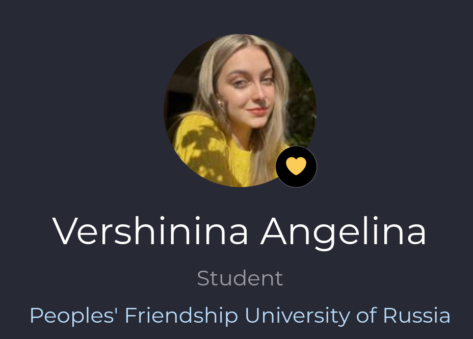
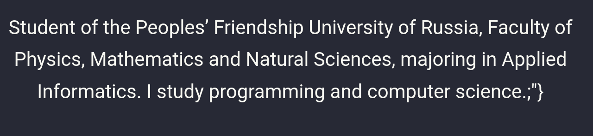
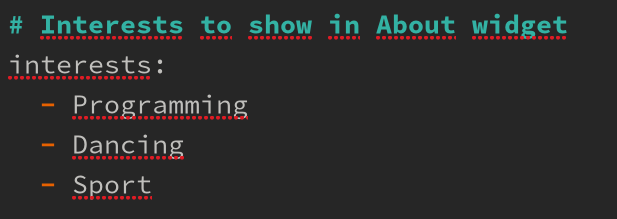
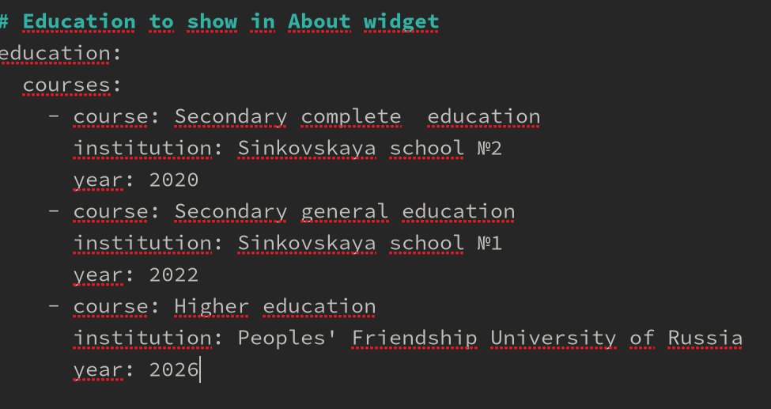
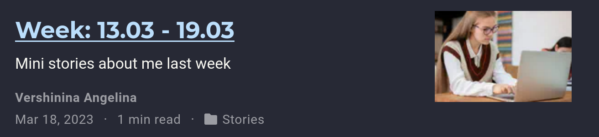

---
## Front matter
lang: ru-RU
title: Индивидуальный проект
subtitle: Этап 2
author:
  - Вершинина Ангелина
institute:
  - Российский университет дружбы народов, Москва, Россия

## i18n babel
babel-lang: russian
babel-otherlangs: english

## Formatting pdf
toc: false
toc-title: Содержание
slide_level: 2
aspectratio: 169
section-titles: true
theme: metropolis
header-includes:
 - \metroset{progressbar=frametitle,sectionpage=progressbar,numbering=fraction}
 - '\makeatletter'
 - '\beamer@ignorenonframefalse'
 - '\makeatother'
---
# Цель работы

Ознакомиться с файлами, которые помогут в создании и изменении сайта

# Задание

Добавить на сайт биографию и интересы. Написать посты

# Выполнение лабораторной работы

## 

- Размещу фотографию владельца сайта и добавлю краткое описание владельца
{width=70%}

{ width=70%}

##

- Добавлю информацию об интересах

{ width=70%}

##

- Добавлю информацию об образовании 

{ width=70%}

##

- Добавлю пост о прошедшей неделе 

{width=70%}

##

- Добавлю пост о СI/CD 

{ width=70%}

# Выводы

В результате выполнения работы я освоила навык добавления информации на сайт

