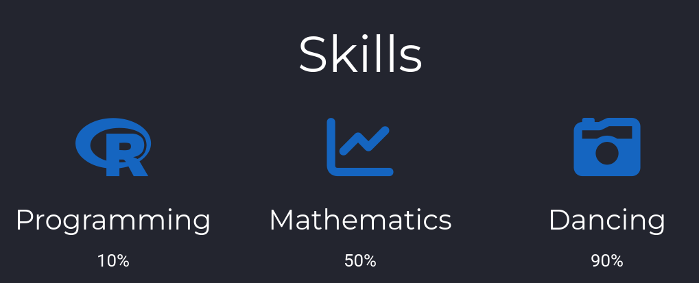
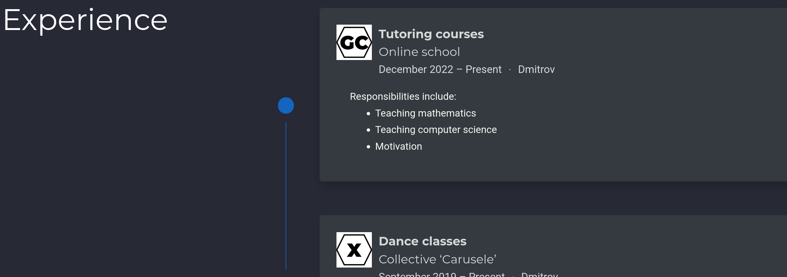
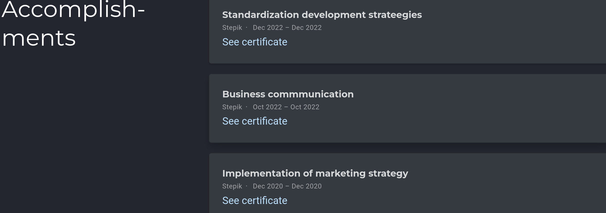
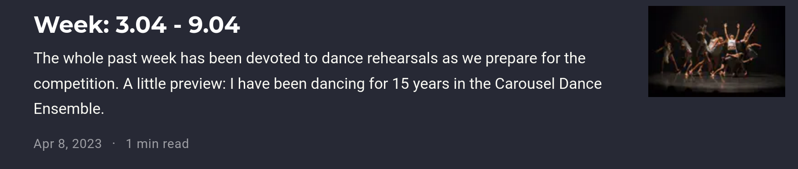
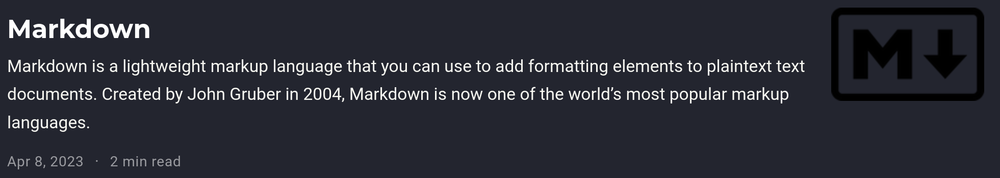

---
## Front matter
lang: ru-RU
title: Индивидуальный проект
subtitle: Этап 3
author:
  - Вершинина Ангелина
institute:
  - Российский университет дружбы народов, Москва, Россия
date: 08 апреля 2023

## i18n babel
babel-lang: russian
babel-otherlangs: english

## Formatting pdf
toc: false
toc-title: Содержание
slide_level: 2
aspectratio: 169
section-titles: true
theme: metropolis
header-includes:
 - \metroset{progressbar=frametitle,sectionpage=progressbar,numbering=fraction}
 - '\makeatletter'
 - '\beamer@ignorenonframefalse'
 - '\makeatother'
---
# Цель работы

# Цель 

- Продолжить изучение навыка создания сайта
Заполню данные навыки (рис. @fig:001).

# Выполнение

##

- Заполню данные навыки (рис. @fig:001).
{#fig:001 width=70%}

##

- Заполню данные опыт (рис. @fig:002).

{#fig:002 width=70%}

##

- Заполню данные достижения (рис. @fig:003).

{#fig:003 width=70%}

##

- Напишу пост о прошедшей неделе (рис. @fig:004).

{#fig:004 width=70%}

##

- Напишу пост о прошедшей неделе (рис. @fig:004).

{#fig:005 width=70%}

# Выводы

## Выводы 
- Я ознакомилась с информацией и попрактиковалась в оформлении сайта

